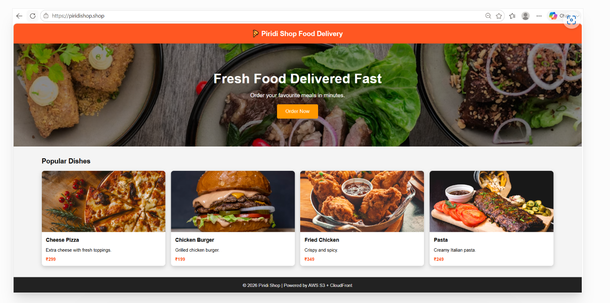

# AWS S3 Static Website Hosting

A complete Infrastructure-as-Code (IaC) solution for hosting a static website on AWS using S3, CloudFront, Route53, and ACM SSL certificates with Terraform.

## 🍕 Piridi Shop - Food Delivery Platform

This repository contains the infrastructure and frontend code for **Piridi Shop**, a modern food delivery static website showcasing popular dishes with a responsive design.



## ✅ Deployment Status

**Successfully Deployed!** The Piridi Shop website is now live and accessible via AWS CloudFront CDN with HTTPS support.

### Live Website Screenshot


The website features:
- **Modern Responsive Design** - Works seamlessly on desktop, tablet, and mobile devices
- **Food Menu Display** - Showcases popular dishes with images and pricing
- **Lightning-Fast Loading** - Powered by CloudFront global CDN
- **HTTPS Security** - SSL/TLS encryption with ACM certificates
- **Custom Domain** - Accessible via piridishop.shop

## 📋 Overview

This project demonstrates a production-ready setup for hosting a static website on AWS with the following features:

- **S3 Bucket**: Secure storage for static website content
- **CloudFront CDN**: Global content delivery with caching
- **Route53**: DNS management and domain routing
- **ACM SSL**: HTTPS/TLS certificate management
- **Terraform**: Infrastructure-as-Code for reproducible deployments

## 🏗️ Architecture

```
Route53 (DNS)
    ↓
CloudFront Distribution (CDN)
    ↓
S3 Bucket (Static Content)
    ↓
ACM Certificate (SSL/TLS)
```

### Key AWS Services Used

| Service | Purpose |
|---------|---------|
| **Amazon S3** | Stores static website files (HTML, CSS, images) |
| **CloudFront** | Global CDN for fast content delivery |
| **Route53** | DNS management and domain routing |
| **ACM** | SSL/TLS certificate provisioning and validation |

## 📁 Project Structure

### Terraform Files (HCL - 54.9%)

- **`provider.tf`** - AWS provider configuration and Terraform version requirements
  - AWS region: `us-east-1`
  - Terraform version: `>= 1.13.0`
  - AWS provider version: `6.43.0`

- **`variable.tf`** - Input variables for the infrastructure
  - `domain_name`: Domain for your website (default: `piridishop.shop`)
  - `bucket_name`: S3 bucket name (default: `piridishop.shop`)

- **`s3.tf`** - S3 bucket configuration
  - Creates S3 bucket for static content
  - Configures bucket policy for CloudFront access
  - Uploads `index.html`, `style.css`, and `error.html`
  - Blocks all public access for security

- **`cloudfront.tf`** - CloudFront distribution setup
  - Creates Origin Access Control (OAC) for secure S3 access
  - Configures CDN distribution with HTTPS enforcement
  - Sets default root object to `index.html`
  - Custom error handling for 403/404 responses
  - SSL/TLS configuration with ACM certificates

- **`acm.tf`** - SSL/TLS certificate management
  - Requests ACM certificate for domain
  - Includes wildcard subdomain support (`*.domain`)
  - DNS validation for certificate ownership

- **`route53.tf`** - DNS and domain routing
  - Creates alias record pointing to CloudFront
  - Manages DNS validation records for ACM certificate
  - Automatic validation record creation and management

- **`output.tf`** - Output values after deployment
  - CloudFront distribution URL
  - Website HTTPS URL

- **`data.tf`** - Data sources for existing AWS resources

### HTML/CSS Files (45.1%)

- **`index.html`** - Main website homepage
  - Responsive food delivery website
  - Hero section with call-to-action
  - Menu items grid displaying popular dishes:
    - Cheese Pizza (₹299)
    - Chicken Burger (₹199)
    - Fried Chicken (₹349)
    - Pasta (₹249)
  - Mobile-friendly design using CSS Grid

- **`error.html`** - Custom error page
  - Displayed for 404 and 403 errors
  - User-friendly error messaging

### Configuration Files

- **`.gitignore`** - Git ignore rules for Terraform
  - Excludes `.tfstate` files
  - Ignores local variables and backups

- **`food-app.PNG`** - Website deployment screenshot
  - Shows the successfully deployed Piridi Shop website
  - Demonstrates responsive design and layout

## 🚀 Getting Started

### Prerequisites

- AWS account with appropriate permissions
- Terraform >= 1.13.0 installed
- AWS CLI configured with credentials
- A registered domain name in Route53

### Installation & Deployment

1. **Clone the repository**
   ```bash
   git clone https://github.com/venkatdevops2009/aws-s3-static-website-hosting.git
   cd aws-s3-static-website-hosting
   ```

2. **Initialize Terraform**
   ```bash
   terraform init
   ```

3. **Update variables (optional)**
   Edit `variable.tf` to customize:
   - `domain_name`: Your domain name
   - `bucket_name`: Your S3 bucket name

4. **Plan the deployment**
   ```bash
   terraform plan
   ```

5. **Apply the infrastructure**
   ```bash
   terraform apply
   ```

6. **Get the outputs**
   ```bash
   terraform output
   ```

### Post-Deployment Steps

1. The CloudFront distribution may take 5-10 minutes to deploy
2. DNS propagation may take up to 24 hours
3. Test your website by accessing the domain or CloudFront URL
4. Verify HTTPS is working with the ACM certificate
5. Check CloudFront logs for access patterns and performance metrics

## 📊 Website Features

### Frontend Components

- **Responsive Design**: Mobile-first approach using CSS Grid
- **Hero Section**: Eye-catching banner with call-to-action button
- **Menu Grid**: Displays food items with images and pricing
- **Footer**: Copyright and attribution
- **Styling**: Modern color scheme with orange/red theme (#ff5722)
- **Images**: External Unsplash images for food items

### Performance Metrics

- **CDN Caching**: Content cached globally via CloudFront
- **HTTPS Enforcement**: All traffic redirected to HTTPS
- **Compression**: Automatic compression for faster delivery
- **Custom Error Pages**: User-friendly error handling
- **Cache Duration**: Default cache behavior configured for optimal performance

### Responsive Breakpoints

- **Desktop**: Full grid layout with 4 columns
- **Tablet**: 2-3 columns depending on screen size
- **Mobile**: Single column responsive design

## 🔒 Security Features

- **S3 Block Public Access**: All public access blocked at S3 bucket level
- **CloudFront Origin Access Control**: Secure S3 access via OAC (SigV4 signed requests)
- **SSL/TLS Encryption**: ACM certificate with TLS 1.2+ enforcement
- **DNS Validation**: Automatic ACM certificate validation via Route53
- **HTTPS Redirect**: All HTTP traffic automatically redirected to HTTPS
- **Bucket Policy**: Restricts access to CloudFront distribution only

## 📈 Customization

### Modify Website Content

Edit `index.html` to:
- Change website title and branding
- Update menu items and pricing
- Modify styling and colors
- Add new sections or features
- Update food images and descriptions

### Change Domain

Update `variable.tf`:
```hcl
variable "domain_name" {
  default = "your-domain.com"
}

variable "bucket_name" {
  default = "your-domain.com"
}
```

### Modify AWS Region

Update `provider.tf`:
```hcl
provider "aws" {
  region = "eu-west-1"  # Change region
}
```

### Add More Menu Items

Edit `index.html` in the cards section:
```html
<div class="card">
  
  <h3>Your Dish Name</h3>
  <p>Description</p>
  <p class="price">₹Price</p>
</div>
```

## 🧹 Cleanup

To remove all AWS resources:

```bash
terraform destroy
```

⚠️ **Warning**: This will delete:
- S3 bucket and all contents
- CloudFront distribution (takes ~15-20 minutes)
- Route53 records
- ACM certificate

## 📝 Language Composition

- **HCL (Terraform)**: 54.9% - Infrastructure-as-Code configuration
- **HTML/CSS**: 45.1% - Frontend website content and styling

## 🛠️ Tools & Technologies

- **Terraform**: Infrastructure automation and management (v1.13.0+)
- **AWS Services**: S3, CloudFront, Route53, ACM
- **HTML5**: Semantic markup for modern websites
- **CSS3**: Responsive styling with Grid and Flexbox
- **DNS**: Route53 for domain management

## 📊 Deployment Outputs

After successful deployment, you will receive:

```
cloudfront_url = d123456789.cloudfront.net
website_url = https://piridishop.shop
```

Access your website using either URL!

## 📚 Resources

- [Terraform AWS Provider Documentation](https://registry.terraform.io/providers/hashicorp/aws/latest/docs)
- [AWS S3 Static Website Hosting](https://docs.aws.amazon.com/AmazonS3/latest/userguide/WebsiteHosting.html)
- [CloudFront Documentation](https://docs.aws.amazon.com/cloudfront/)
- [Route53 Documentation](https://docs.aws.amazon.com/route53/)
- [AWS ACM Documentation](https://docs.aws.amazon.com/acm/)

## 🐛 Troubleshooting

### Certificate Validation Issues
- Ensure Route53 hosted zone exists for your domain
- Check DNS records are properly created
- Wait 5-10 minutes for validation records to propagate

### CloudFront Not Serving Content
- Verify S3 bucket policy allows CloudFront access
- Check Origin Access Control (OAC) is properly configured
- Clear CloudFront cache if needed

### DNS Not Resolving
- Verify Route53 alias record points to CloudFront
- Check nameservers are updated in domain registrar
- Wait up to 24 hours for DNS propagation

### Website Shows 403 Errors
- Confirm `index.html` exists in S3 bucket
- Check S3 bucket public access is blocked (expected)
- Verify CloudFront OAC has proper permissions

## 📞 Support

For issues or questions:
- Check existing GitHub Issues
- Review AWS documentation
- Verify Route53 hosted zone exists for your domain
- Enable CloudFront access logs for debugging

## 📄 License

This project is open source and available under the MIT License.

## 👨‍💼 Author

**Venkat DevOps** - [GitHub Profile](https://github.com/venkatdevops2009)

---

**Successfully Deployed! 🚀**

Built with ❤️ using Terraform and AWS

**Status**: ✅ Live at [piridishop.shop](https://piridishop.shop)
